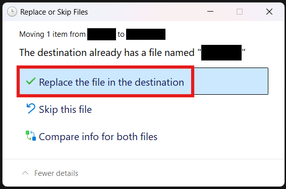

# Playing online games
If you want to play games like Schedule I, R.E.P.O. or others with friends, you have to install an Online Fix.

### 1. Open & Setup [Online-Fix](https://online-fix.me/)
1. **Open Online-Fix** - https://online-fix.me/
2. **Select your languauge** - The website is in Russian, so if you don't understand Russian, choose English in the top right corner.
3. **Register** You need to register to access any of the download links. Hover over the Register button and choose either Google or Discord.

### 2. Find your game
Find the game you want to play online on. This will not work on games like Fifa.

When you’ve found your game, scroll down until you see the Download buttons. Click on the **Download from Online-fix Hosters** button, and the download page will open. Select the file that has the following name: **[Game Name]_Fix_Repair_Steam_V[Something]_Generic.rar**

### 3. Download WinRAR
If you haven’t already, [download and install WinRAR](https://www.win-rar.com/postdownload.html)

### 4. Drag the files into the game’s folder
Open the game’s folder (How to open Steam game's folder?), then open the the .rar file you’ve downloaded. The password is `online-fix.me`. Select all of the files inside of the .rar file and drag them into the game’s folder. When a window like this pops up:

Click **Replace the file in the destination**. It could appear multiple times.

### Congrats!
If you’ve followed all of the steps correctly, you should have online working.

:::note
When you start the game, Windows Defender might detect a “threat”. Dismissing a false positive in Windows Defender
:::