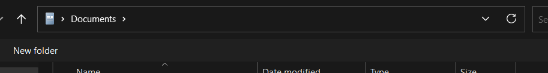

# Removing a game
If you want to remove a game from your library installed with SteamTools, you have to use our Steam Games Remover.

### 1. [Download](https://github.com/Manifestor-cc/game-remover/releases/latest/download/game-remover.exe) and run the remover

:::note
**The Game Remover is open-source!** [Check it out on GitHub](https://github.com/Manifestor-cc/game-remover/)
:::

### 2. Click Browse and select Steam directory
When you click Browse, it should select it automatically, you just need to click Select Folder.

<details>
<summary>If it didn't select automatically</summary>
```
C:\Program Files (x86)\Steam
```
Copy the path above and paste it into the top bar.


<sub>(The top bar)</sub>

</details>

### 3. Open SteamDB and find your game's AppID

### 4. Paste the AppID and click Delete Game

### 5. Restart Steam through SteamTools

### Congrats!
If you've followed all of the steps correctly, you should have removed the game from your Steam Library.