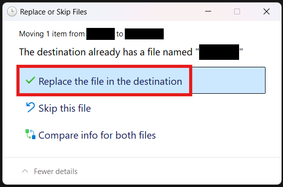

# Assasin’s Creed Games

### 1. [Download](https://i.sobakintech.xyz/s/kCORI3Ex) the bypass files for your desired game
Supported games:

- Assassin's Creed Mirage
- Assassin's Creed Valhalla
- Assassin's Creed Odyssey
- Assassin's Creed Origins
- Assassin's Creed Syndicate
- Assassin's Creed Unity
- Assassin's Creed Rogue
- Assassin's Creed IV: Black Flag
- Assassin's Creed III Remastered
- Assassin's Creed III
- Assassin's Creed: Brotherhood
- Assassin's Creed II

[Download](https://i.sobakintech.xyz/s/kCORI3Ex)

### 2. Drag the files into the game’s folder
Open the game’s folder (How to open Steam game's folder?), then open the the .zip file you’ve downloaded. Select all of the files and drag them into the game’s folder. When a window like this pops up:

Click **Replace the file in the destination**. It could appear multiple times.

### Congrats!
If you’ve followed all of the steps correctly, you should be able to play your desired Assasin’s Creed game.

:::note
For some games, you may need to start them directly via the .exe, not trough the Steam Library.
:::