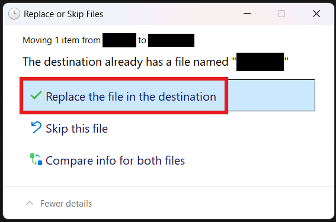

# Star Wars Games

### 1. Download the bypass files for your desired game
| Name | Download |
|------|----------|
| Jedi: Fallen Order | [Download](https://pixeldrain.com/u/NnnHpdju) |
| Jedi: Survivor | [Download](https://pixeldrain.com/u/X6JPATK3) |

### 2. Drag the files into the game's folder
Open the game's folder ([How to open Steam game's folder?](/extras/opening_a_steam_games_folder)), then open the the .zip file you've downloaded. Select the folder inside of the .zip file and drag it into the game's folder. When a window like this pops up:

Click **Replace the file in the destination**. It could appear multiple times.

### Congrats!
If you've followed all of the steps correctly, you should now be able to play your Star Wars game.

:::important
Every time you want to play the game, you have to launch it using the .exe file, not from Steam.
:::