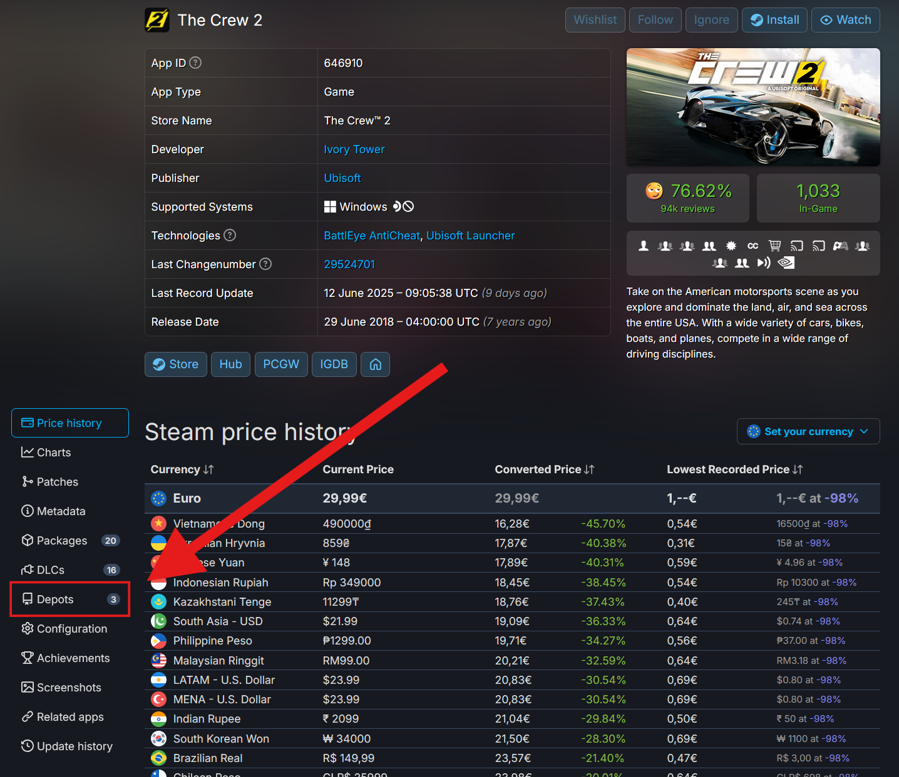
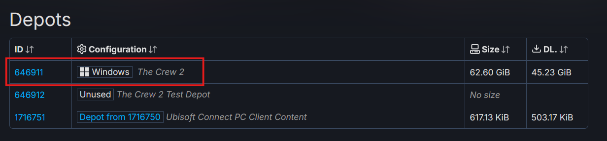
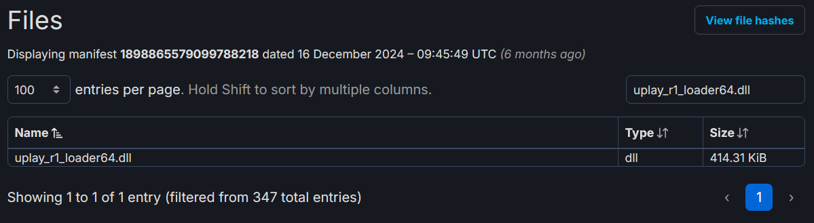

# Ubisoft

### 1. Open [SteamDB](https://steamdb.info) and search for your game

### 2. In the side panel, click on Depots

### 3. Click on the ID of the configuration that’s named as the game
Example for The Crew 2:

### 4. In the Files section
Paste `uplay_r1_loader64.dll` in the search field.

If it appears in the list

Like so:

**Good news!** You can continue following the steps.

If it says No matching records found

Sadly, the bypass won’t work for your game.

### 5. [Download](https://files.catbox.moe/bidh37.zip) the patched .dll file

### 6. Drag the file into the game’s folder
Open the game’s folder ([How to open Steam game's folder?](/extras/opening_a_steam_games_folder)), and drag the file you downloaded into the game’s folder. When a window like this pops up:

Click **Replace the file in the destination**.

### Congrats!
If you’ve followed all of the steps correctly, you should be able to play your Ubisoft game.