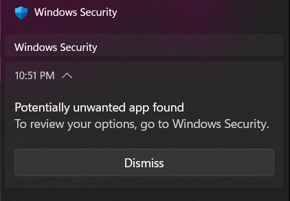

# Dismissing a false positive in Windows Defender
When you start a game with Online-Fix installed for the first time, it might detect a .dll file as a virus, which is not true.

### 1. Start the game
Start the game which has Online-Fix installed, and wait for the Windows Defender pop-up to appear.

:::note
If the pop-up doesn’t appear, open Windows Security from the Start menu, open Virus & threat protection, then Protection history and select the top item.
:::

### 2. Click on the Windows Defender pop-up

When the app opens, it will ask for administrator permissions.

### 3. Dismiss the false positive
Click on Actions > Allow on device. It will ask for administrator permissions again.

### 4. Restart the game
Just to make sure everything will work.

### Congrats!
If you’ve followed all of the steps correctly, you should now have prevented Windows Defender from removing the detected file.